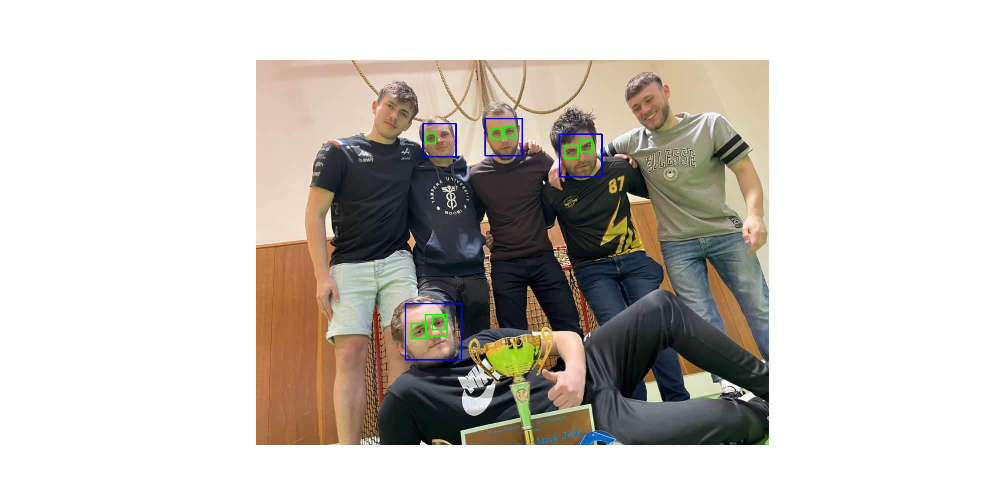
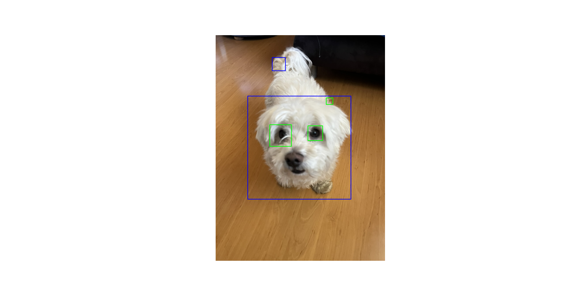
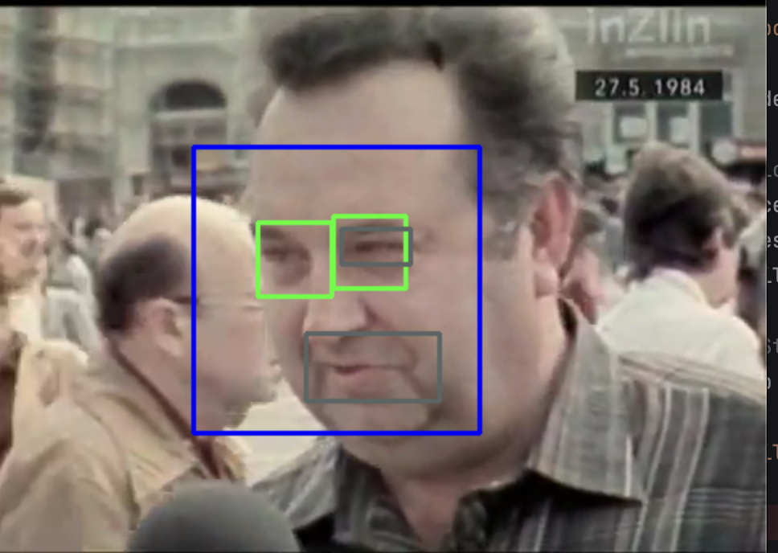
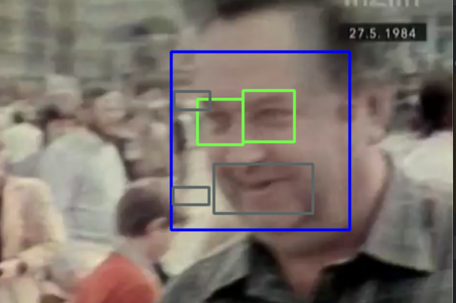
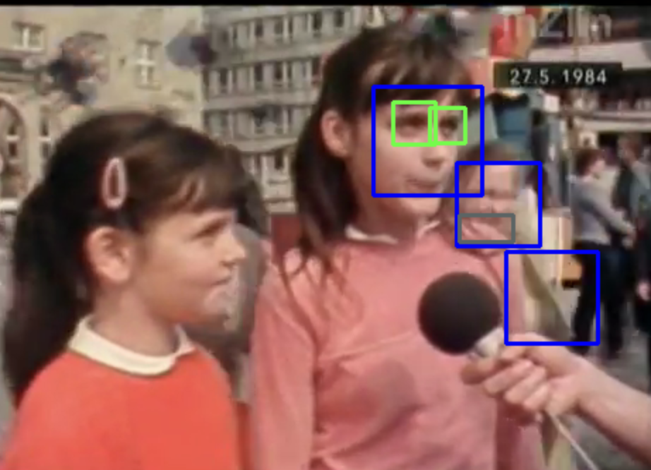

## Knihovna OpenCV

# Využité haar kaskády
```$python
    face_classifier: haarcascade_frontalface_default.xml
    eyes_classifier: haarcascade_eye.xml
    smile_classifier: haarcascade_smile.xml
```

## Fotografie

Vykreslení očí a obličeje pro rozpoznané obličeje:


Přidání úsměvu:


Vyzkoušela jsem i na psovi, kde úsměv nebyl rozpoznán:


## Video
Analýzu videa jsem zkusila na random videu z roku 1984 ze Zlína, protože mě zajímalo, jestli to zvládne i méně kvalitní video.
https://www.youtube.com/watch?v=dhkRwjkZku0

S videem se to vypořádalo poměrně dobře, i když občas rozpoznávalo i objekty navíc.

Screenhoty s rozpoznanými obličeji:


